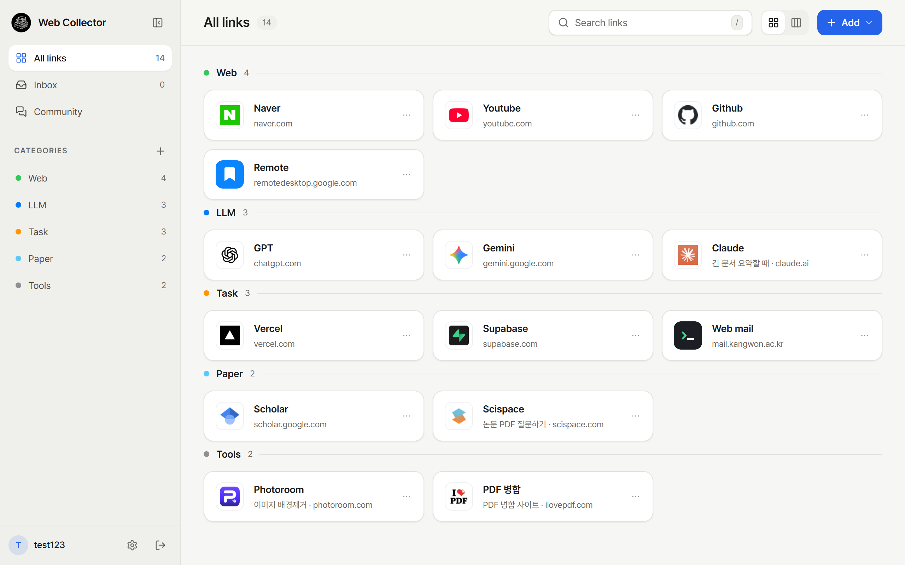
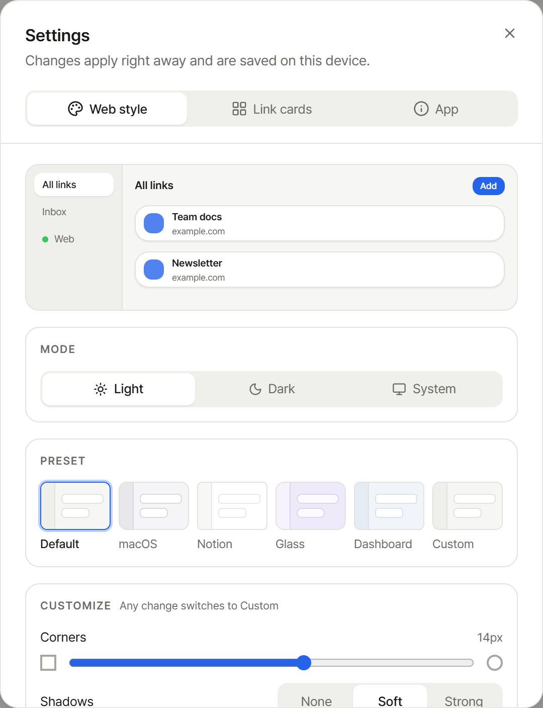
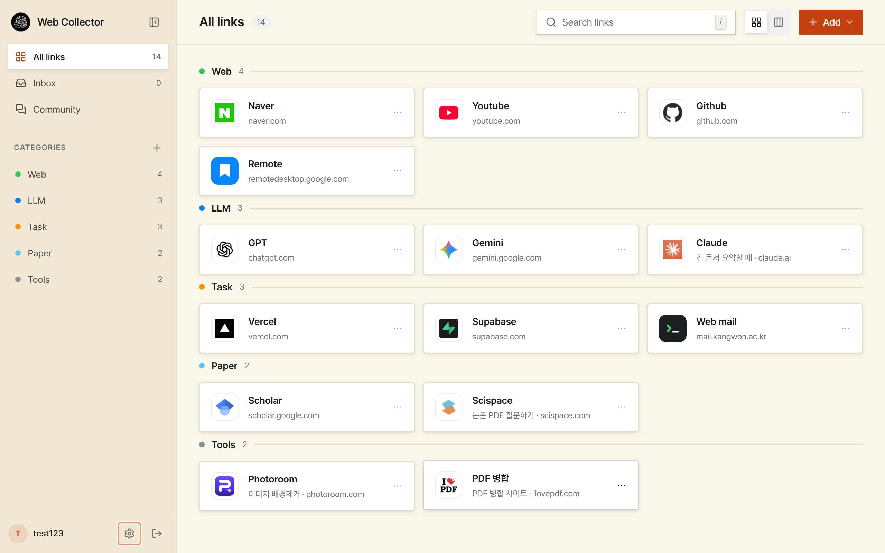
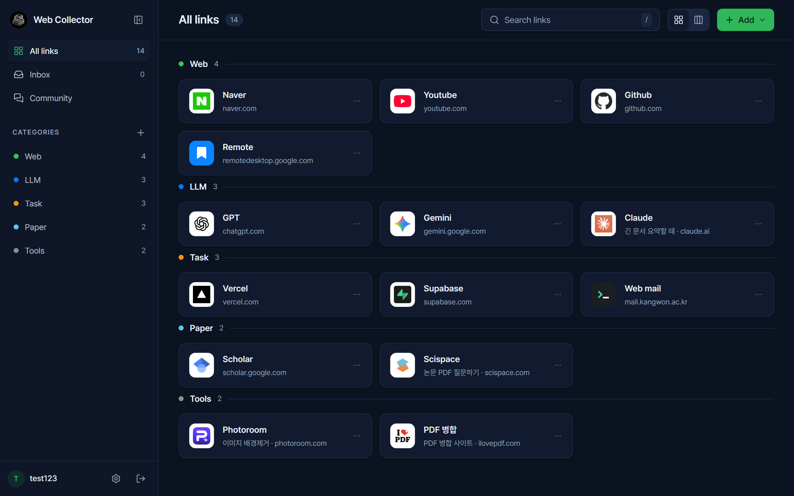
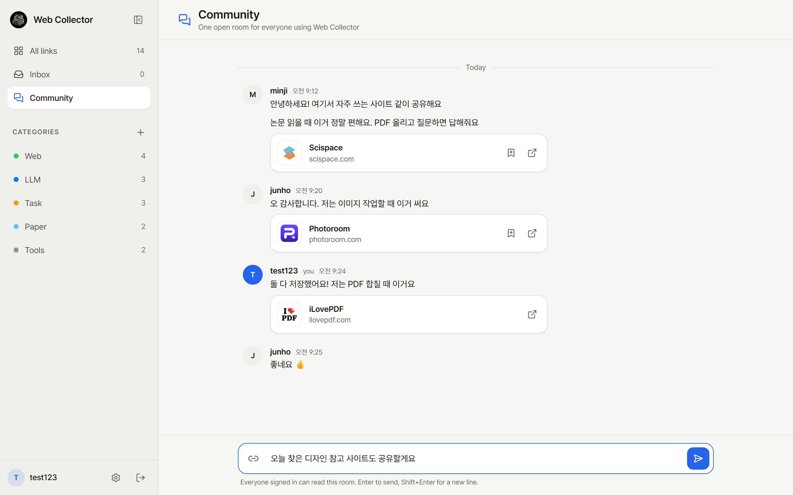
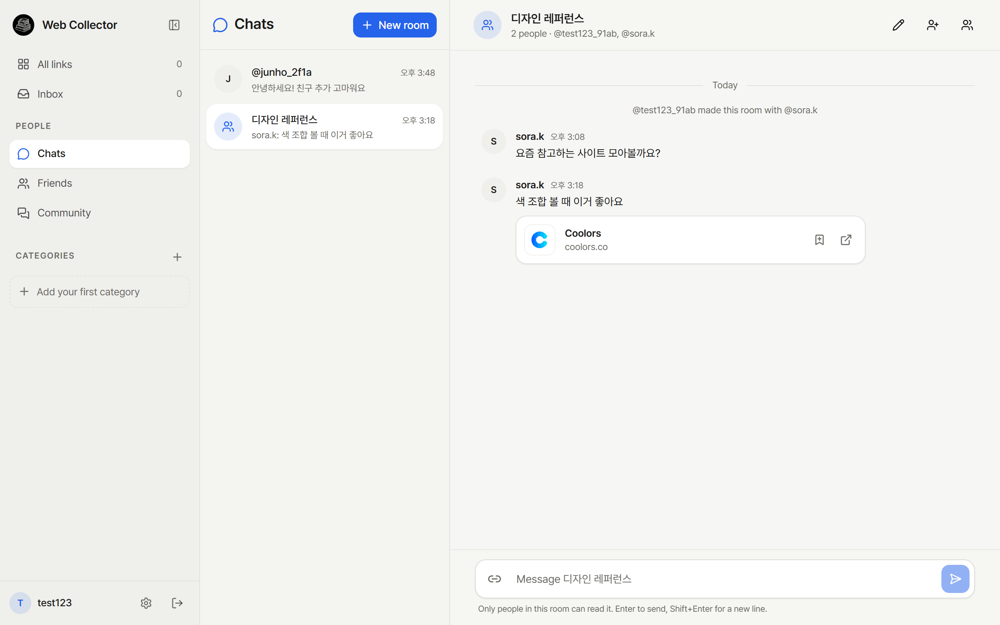
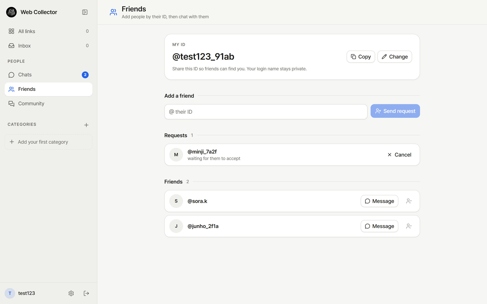

# web_collector v4

자주 쓰는 웹사이트를 카테고리별로 모아 두고 한 번에 여는 **개인용 북마크 매니저**입니다.
웹과 데스크톱 앱(Electron)으로 쓸 수 있고, v4에서는 화면 디자인을 전체적으로 다시 정리하고
**웹 스타일 커스텀**, **커뮤니티(공개 톡방)**, **친구 · 톡방** 기능을 더했습니다.



---

## 주요 기능

### 링크 관리
- 카테고리별 링크 정리, 드래그 앤 드롭으로 순서·카테고리 변경
- 사이트 파비콘 자동 표시 (없으면 카테고리 기본 아이콘 20종 중 하나)
- 링크 메모, 검색(`/` 키로 바로 이동, `Esc`로 지우기)
- **매크로**: 여러 사이트를 한 번에 여는 묶음 (예: 아침 루틴)
- 북마크 가져오기(JSON, 브라우저 북마크 HTML) / 내보내기(JSON)
- 섹션 보기와 보드(칸반) 보기

### 웹 스타일 (설정 → Web style)
- 모드: 밝게 / 어둡게 / 시스템
- 스타일 프리셋 5종: Default, macOS, Notion, Glass, Dashboard
- **Custom**: 모서리(0~24px), 그림자 3단계, 색 5가지(배경·사이드바·카드·테두리·글자)를 직접 설정
- 강조색 6가지 + 색상 선택기로 원하는 색 직접 지정
- 링크 카드 모양(Compact / Tile), 높이, 마우스 올림 효과 선택 (설정 → Link cards)

| 설정 | 커스텀 적용 | 어두운 프리셋 |
|---|---|---|
|  |  |  |

### 커뮤니티 · 친구 · 톡방
- **커뮤니티**: 모든 사용자가 함께 쓰는 공개 톡방 하나
- **공개 ID(@아이디)**: 로그인 아이디와 별개. 다른 사람에게는 이 ID만 보입니다
- **친구**: ID로 친구 요청 → 수락 / 거절
- **톡방**: 1:1 대화, 이름을 붙인 단체 톡방, 사람 추가 · 내보내기 · 나가기
- 대화 중 **사이트 공유** → 받은 사람은 버튼 하나로 내 링크에 저장
- 사이드바 배지로 안 읽은 메시지와 받은 친구 요청 표시

| 커뮤니티 | 톡방 | 친구 |
|---|---|---|
|  |  |  |

> 스크린샷의 링크와 대화는 예시 데이터입니다.

---

## 기술 스택

| 영역 | 사용 기술 |
|---|---|
| 프레임워크 | Next.js 16 (App Router), React 19, TypeScript |
| 스타일 | Tailwind CSS 4, shadcn/ui(Radix), Pretendard 글꼴, lucide 아이콘 |
| 상태 관리 | Zustand |
| 드래그 앤 드롭 | dnd-kit |
| 데이터베이스 | Supabase (PostgreSQL) — 앱 서버(Next.js API)가 service role 키로 접근 |
| 인증 | 자체 JWT + httpOnly 쿠키, Google 로그인(Supabase Auth) |
| 데스크톱 앱 | Electron (배포된 웹사이트를 여는 방식), electron-builder, GitHub Releases 자동 업데이트 |

## 폴더 구조

```
web_collector v4/
├── frontend/                 # 웹 앱 + API + 데스크톱 앱 (실제로 실행하는 부분)
│   ├── src/
│   │   ├── app/              # 화면과 API 라우트 (api/links, api/rooms, api/friends …)
│   │   ├── components/       # links, layout, settings, chat, social, community, ui
│   │   ├── lib/              # 스타일·파비콘·대화 규칙, 서버 도우미
│   │   └── store/            # 로그인 상태
│   ├── electron/             # 데스크톱 앱
│   └── .env.example          # 환경 변수 예시
├── backend/                  # 이전 버전의 Express 서버 (현재 앱은 사용하지 않음)
├── supabase/                 # DB 변경 SQL (날짜순으로 실행)
├── docs/images/              # README 스크린샷
├── V4_CHANGES.md             # V3 → V4 변경 보고서
└── V4_새기능_보고서.pdf       # 새 기능 캡처 보고서
```

---

## 시작하기

### 1. 준비물
- Node.js 20 이상
- Supabase 프로젝트 (users, categories, links, macro_items 등 기본 테이블이 있는 DB)

### 2. 설치

```bash
cd frontend
npm install
```

### 3. 환경 변수
`frontend/.env.example`을 `frontend/.env.local`로 복사해 값을 채웁니다.

| 변수 | 설명 |
|---|---|
| `NEXT_PUBLIC_SUPABASE_URL` | Supabase 프로젝트 주소 |
| `NEXT_PUBLIC_SUPABASE_ANON_KEY` | Supabase 공개(anon) 키 |
| `SUPABASE_SERVICE_ROLE_KEY` | 서버 전용 키. **절대 공개하지 마세요** |
| `JWT_SECRET` | 로그인 쿠키 서명용. 길고 무작위인 문자열 |

`.env.local`은 `.gitignore`에 들어 있어 저장소에 올라가지 않습니다.

### 4. DB 설정
Supabase 대시보드 → **SQL Editor**에서 실행합니다.

- **새 프로젝트**: `supabase/00_setup_new_project.sql` **하나만** 실행하면 필요한 표 12개가 모두 만들어집니다.
- **이미 쓰던 DB**: 날짜가 붙은 파일을 날짜순으로 실행합니다.
  1. `20260427_add_category_default_favicon_id.sql` — 카테고리 기본 아이콘
  2. `20260923_add_community_messages.sql` — 커뮤니티
  3. `20260927_add_friends_and_chat_rooms.sql` — 공개 ID, 친구, 톡방
  4. `20260928_add_message_reactions.sql` — 메시지 공감 표시

모든 표는 RLS로 잠가 두어 공개 키로는 접근할 수 없고, 앱 서버(관리자 키)로만 읽고 씁니다.

### 5. 실행

```bash
cd frontend
npm run dev            # http://localhost:30101
```

포트를 바꾸려면 `npm run dev -- -p 30102`처럼 실행합니다.

---

## 배포

### 웹사이트 (Vercel)
1. Vercel에서 이 저장소를 가져오고 **Root Directory를 `frontend`**로 지정합니다.
2. 환경 변수 4개(`NEXT_PUBLIC_SUPABASE_URL`, `NEXT_PUBLIC_SUPABASE_ANON_KEY`, `SUPABASE_SERVICE_ROLE_KEY`, `JWT_SECRET`)를 넣습니다.
3. 이후 `main`에 올릴 때마다 자동으로 배포됩니다.
4. Google 로그인을 쓰면 Supabase → Authentication → URL Configuration의 Redirect URLs에 `https://<Vercel 주소>/auth/callback`을 추가합니다.

### 데스크톱 앱 (Windows / Mac)
데스크톱 앱은 **배포된 웹사이트를 창으로 여는 방식**입니다. 설치 파일에는 비밀 키가 들어가지 않고, 웹을 고치면 앱 화면도 바로 최신이 됩니다.

처음 한 번만: GitHub 저장소 → Settings → Secrets and variables → Actions → **Variables**에
`WEB_COLLECTOR_APP_URL` = `https://<Vercel 주소>` 를 추가합니다. (비밀값이 아니며, 다른 토큰은 필요 없습니다)

새 버전 내기:
```bash
# 1) frontend/package.json 의 "version" 을 올리고 커밋
# 2) 같은 번호로 태그를 올리면 GitHub가 Windows·Mac 설치 파일을 만들어 Releases에 게시합니다
git tag v1.0.28
git push origin v1.0.28
```

- **Windows**: 설치된 앱이 켤 때와 6시간마다 새 버전을 확인해 뒤에서 받아 두고, "다시 시작" 알림을 띄웁니다.
- **Mac**: Apple 서명이 없어 macOS가 자동 설치를 막기 때문에, 새 버전을 알리고 다운로드 페이지를 엽니다.
- 홈페이지의 **Download** 버튼(`/api/download/windows`, `/api/download/mac`)은 항상 최신 릴리스를 가리킵니다.
- 서명이 없어 처음 설치할 때 Windows·Mac 모두 보안 경고가 뜹니다. 해결 방법은 홈페이지 다운로드 영역에 안내되어 있습니다.

로컬에서 확인할 때:
```bash
npm run electron:dev                                              # 개발 서버 + 앱 함께 실행
WEB_COLLECTOR_APP_URL=https://<주소> npm run electron:build       # Windows 설치 파일 만들기
```

---

## v3 → v4 변경 요약
- 화면 디자인 전체 개편: 색 체계, 글꼴, 모서리·그림자 규칙 통일, 사이드바·상단바·카드·대화상자·로그인·첫 화면
- 설정을 탭 3개(Web style / Link cards / App)로 분리
- 웹 스타일 프리셋 5종 + 커스텀, 강조색 직접 선택 (새로고침해도 유지)
- 커뮤니티, 공개 ID, 친구, 톡방 추가
- 버그 수정: 테마가 새로고침하면 풀리던 문제, 파비콘 없는 사이트의 회색 지구본, 매크로 카드 정렬 등

자세한 내용은 [V4_CHANGES.md](V4_CHANGES.md)를 보세요.

## 알려진 한계
- 설치 파일에 코드 서명이 없어 처음 설치할 때 보안 경고가 뜹니다. Mac은 자동 업데이트 대신 새 버전 알림만 됩니다.
- 새 메시지는 몇 초마다 확인하는 방식입니다 (실시간 푸시 아님).
- 차단 기능은 아직 없습니다. 친구가 아닌 사람은 톡방에 넣을 수 없습니다.
- 커뮤니티에서 다른 사람이 지운 메시지는 새로고침 전까지 화면에 남을 수 있습니다.
